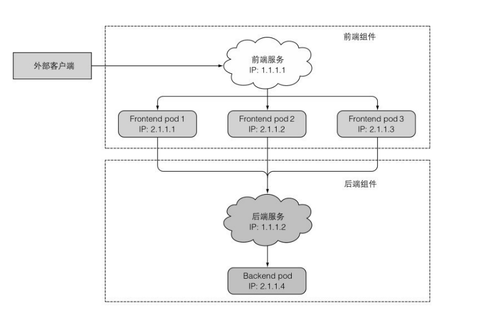

# 服务：让客户端发现 pod 并与之通信

## 1.介绍服务

Kubernetes 服务是⼀种为⼀组功能相同的 pod 提供单⼀不变的接⼊点的资源。当服务存在时，它的 IP 地址和端⼜不会改变。客户端通过 IP 地址和端口号建⽴连接，这些连接会被路由到提供该服务的任意⼀个 pod 上。服务的 IP 地址固定不变。



### 创建服务


```yaml
apiVersion: v1
kind: Service
metadata:
  name: kubia
spec:
  sessionAffinity: ClientIP #设置请求亲和性：保证一个 Client 的所有请求都只会落到同一个 Pod
  ports:
    - name: http
      port: 80
      targetPort: http
    - name: https
      port: 443
      targetPort: https # defined in pod template.spec.containers.ports array
  selector:
    app: kubia
```

### 服务发现

客户端和 Pod 都需知道服务本身的 IP 和 Port，才能与其背后的 Pod 进行交互。

环境变量：kubectl exec kubia-qgtmw env 会看到 Pod 的环境变量列出了 Pod 创建时的所有服务地址和端口，如 SVCNAME_SERVICE_HOST 和 SVCNAME_SERVICE_PORT 指向服务。

DNS 发现：Pod 上通过全限定域名 FQDN 访问服务：`<service_name>.<namespace>.svc.cluster.local`

```bash
> kubectl exec kubia-qgtmw cat /etc/resolv.conf
nameserver 10.96.0.10
search default.svc.cluster.local svc.cluster.local cluster.local # 会
options ndots:5
```

在 Pod kubia-qgtmw 中可通过访问 kubia.default.svc.cluster.local 来访问 kubia 服务，在 /etc/resolv.conf 中指明了域名解析服务器地址，以及主机名补全规则，是在 Pod 创建时候，根据 namespace 手动导入的。

## 2.Service 对内部解析外部

集群内部的 Pod 不直连到外部的 IP:Port，而是同样定义 Service 结合外部 endpoints 做代理中间层解耦。如获取百度首页的向外解析：

1.1 建立外部目标的 endpoints 资源：

```yaml
apiVersion: v1
kind: Endpoints
metadata:
  name: baidu-endpoints

subsets:
  - addresses:
      - ip: 220.181.38.148 # baidu.com
      - ip: 39.156.69.79
    ports:
      - port: 80
```

1.2 或者建立外部解析别名

```yaml
apiVersion: v1
kind: Service
metadata:
  name: baidu-endpoints
spec:
  type: ExternalName
  externalName: www.baidu.com
  ports:
    - port: 80
```

再建立同名的 Service 代理，标识使用上边这组 endpoints

```yaml
apiVersion: v1
kind: Service
metadata:
  name: baidu-endpoints
spec:
  ports:
    - port: 80
```

效果：在集群内部 Pod 上可透过名为 baidu-endpoints 的 Service 连接到百度首页：

```shell
# root@kubia-72sxt:/# curl 10.103.134.52

root@kubia-72sxt:/# curl baidu-endpoints

<html>
<meta http-equiv="refresh" content="0;url=http://www.baidu.com/">
</html>
```

注意 Service 类型：

```shell
> kubectl get svc
NAME              TYPE           CLUSTER-IP     EXTERNAL-IP     PORT(S)          AGE
baidu-endpoints   ExternalName   <none>         www.baidu.com   80/TCP           30m
kubernetes        ClusterIP      10.96.0.1      <none>          443/TCP          5d2h
kubia             ClusterIP      10.96.239.1    <none>          80/TCP,443/TCP   87m
```

## 3.Service 对外部解析内部

### NameNode

使用：外部客户端直连宿主机端口访问服务。

原理：在集群所有节点暴露指定的端口给外部客户端，该端口会将请求转发 Service 进一步转发给节点上符合 label 的 Pod，即 Service 从所有节点收集指定端口的请求并分发给能处理的 Pod

缺点：高可用性需由外部客户端保证，若节点下线需及时切换。

```yaml
apiVersion: v1
kind: Service
metadata:
  name: kubia-nodeport
spec:
  type: NodePort
  ports:
    - port: 80
      targetPort: 8080
      nodePort: 30001
  selector:
    app: kubia
```

三个端口号，节点转发 30001，Service 转发 80：

宿主机即外部，执行 `curl MINIKUBE_NODE_IP:30001` 会被转发到有 `app:kubia` 标签的 Pod 的 8080 端口。执行 `curl NAME_PORT:80` 同理。

### LoadBalancer

场景：外部客户端直连 LB 访问服务。其是 K8S 集群端高可用的 NameNode 扩展。

```yaml
apiVersion: v1
kind: Service
metadata:
  name: kubia-loadbalancer
spec:
  type: LoadBalancer
  ports:
    - port: 80
      targetPort: 8080
  selector:
    app: kubia
```

k8s `app:kubia` 所在的所有节点打开随机端口 **32148**，进一步转发给 Pod 的 8080 端口。

```bash
kubia-loadbalancer   LoadBalancer   10.108.104.22   <pending>       80:32148/TCP     4s
```

## 4.Ingress

顶级转发代理资源，仅通过一个 IP 即可代理转发后端多个 Service 的请求。需要开启 nginx controller 功能

```yaml
apiVersion: networking.k8s.io/v1beta1
kind: Ingress
metadata:
  name: kubia
spec:
  rules:
    - host: "kubia.example.com"
      http:
        paths:
          - path: /kubia # 将 /kubia 子路径请求转发到 kubia-nodeport 服务的 80 端口
            backend:
              serviceName: kubia-nodeport
              servicePort: 80
          - path: /user # 可配置多个 path 对应到 service
            backend:
              serviceName: user-svc
              servicePort: 90
    - host: "new.example.com" # 可配置多个 host
      http:
        paths:
          - path: /
            backend:
              serviceName: gooele
              servicePort: 8080
```

## 5.就绪探针

场景：pod 启动后并非立刻就绪，需延迟接收来自 service 的请求。若不定义就绪探针，pod 启动就会暴露给 service 使用，所以需像存活探针一样添加指定类型的就绪探针：

```yaml
#...
spec:
  containers:
    - name: kubia-container
      image: yinzige/kubia
      readinessProbe:
        exec:
          command:
            - ls
            - /var/ready_now
```

## 6.headless

场景：向客户端暴露所有 pod 的 IP，将 ClusterIP 置为 None 即可：

```yaml
apiVersion: v1
kind: Service
metadata:
  name: kubia-headless
spec:
  clusterIP: None
  ports:
    - port: 80
      targetPort: 8080
  selector:
    app: kubia
```

k8s 不会为 headless 服务分配 IP，通过 DNS 可直接发现后端的所有 Pod

```shell
> kubectl get svc
NAME             TYPE           CLUSTER-IP       EXTERNAL-IP   PORT(S)        AGE
kubia            LoadBalancer   10.104.138.112   <pending>     80:32110/TCP   123m
kubia-headless   ClusterIP      None             <none>        80/TCP         10m
root@dnsutils:/# nslookup kubia-headless
Server:         10.96.0.10
Address:        10.96.0.10#53
Name:   kubia-headless.default.svc.cluster.local
Address: 172.17.0.6
Name:   kubia-headless.default.svc.cluster.local
Address: 172.17.0.12
Name:   kubia-headless.default.svc.cluster.local
Address: 172.17.0.10
Name:   kubia-headless.default.svc.cluster.local
Address: 172.17.0.8
root@dnsutils:/# nslookup kubia
Server:         10.96.0.10
Address:        10.96.0.10#53
Name:   kubia.default.svc.cluster.local
Address: 10.104.138.112
```
