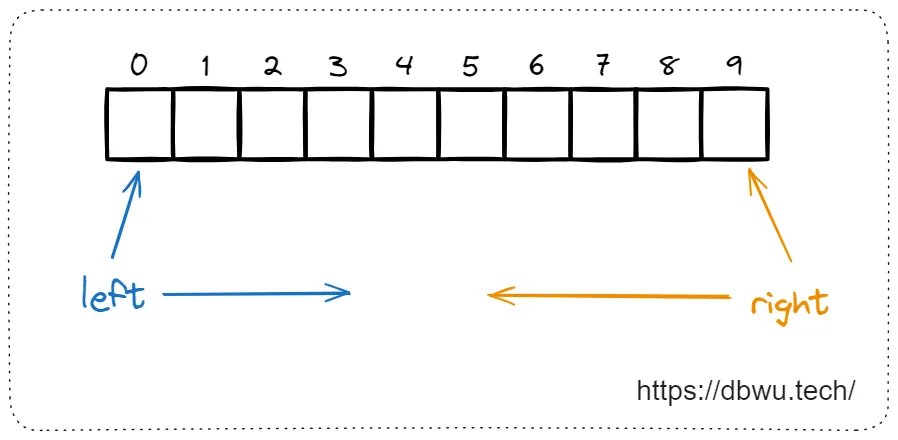
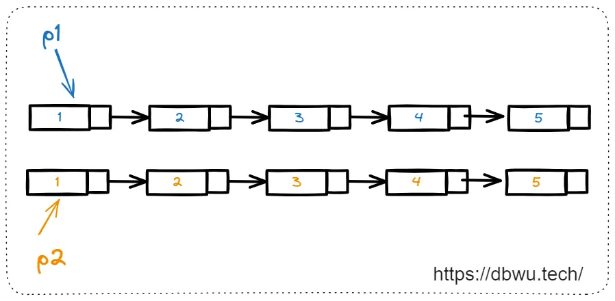

# 基础

## 1. 快慢指针

最经典的双指针使用场景
一般情况下，快慢指针的固定命名:

```
快指针:  fast慢指针:  slow
```


快慢指针示例

## 2. 左右指针

通常用于解决数组或字符串问题，其中:

- 左指针通常指向数组下标 0 ，字符串的开始位置
    
- 右指针通常指向数组下标 N-1 (其中 N 为数组长度)，字符串的结束位置
    

一般情况下，左右指针的固定命名:

```
左指针:  left右指针:  right
```



左右指针示例

## 3. 无序指针

如果两个指针没有任何语义和逻辑顺序，只是用于指向不同的地址，也可以直接简单命名。

例如在合并两个有序链表这道题中，可以使用两个无序指针分别指向链表 1 和链表 2:

```
指针 1: p1指针 2: p2
```



无序指针示例

## 4. 头尾指针

这种场景中，两个指针每次移动的位置不一样，可能移动也可能原地不动 (所以单纯应用角度分析的话，**头尾双指针属于快慢双指针的子集**)，例如使用数组使用的环形队列数据结构。

一般情况下，头尾指针的固定命名:

```
头指针 1: head尾指针 2: tail
```


# 头尾双指针

头尾双指针的典型使用场景是：

- **头指针** 作为数组/字符串的遍历索引，从起始位置遍历到结束位置

- **尾指针** 作为条件指针，每次移动 0 个位置或 1 个位置，并在满足题目逻辑条件时更新返回值，或者自身作为最终返回值

## [26. 删除有序数组中的重复项](https://leetcode.cn/problems/remove-duplicates-from-sorted-array/)

给你一个 **非严格递增排列** 的数组 `nums` ，请你 **[原地](http://baike.baidu.com/item/%E5%8E%9F%E5%9C%B0%E7%AE%97%E6%B3%95)** 删除重复出现的元素，使每个元素 **只出现一次** ，返回删除后数组的新长度。元素的 **相对顺序** 应该保持 **一致** 。然后返回 `nums` 中唯一元素的个数。

**示例 1：**

> **输入：** nums = [1,1,2]
> **输出：** 2, nums = [1,2,_]
> **解释：** 函数应该返回新的长度 **`2`** ，并且原数组 _nums_ 的前两个元素被修改为 **`1`**, **`2`** `。` 不需要考虑数组中超出新长度后面的元素。

解题思路：

**使用两个指针,**`tail` 指针指向最后一个不重复元素的位置。`head` 指针用于遍历数组。
- 如果 `head` 指针指向的元素与 `tail` 指针指向的元素不同，则 `tail` 前进一步，并将 `head` 指向的元素复制到 `tail` 位置。
- `tail + 1` 即为去重后数组的长度。

```go
func removeDuplicates(nums []int) int {
    tail := 0
    
    for head := 1; head < len(nums); head++ {
        if nums[head] != nums[tail] {
            tail++
            nums[tail] = nums[head]
        }
    }

    return tail + 1
}
```

## [27. 移除元素](https://leetcode.cn/problems/remove-element/description/)

给你一个数组 `nums` 和一个值 `val`，你需要 **[原地](https://baike.baidu.com/item/%E5%8E%9F%E5%9C%B0%E7%AE%97%E6%B3%95)** 移除所有数值等于 `val` 的元素。元素的顺序可能发生改变。然后返回 `nums` 中与 `val` 不同的元素的数量。

**示例 1：**

> **输入：** nums = [3,2,2,3], val = 3
> **输出：** 2, nums = [2,2,_,_]
> **解释：** 你的函数函数应该返回 k = 2, 并且 nums 中的前两个元素均为 2。
> 你在返回的 k 个元素之外留下了什么并不重要（因此它们并不计入评测）。

解题思路：

使用两个指针,`tail` 指向当前处理的最后一个不等于 `val` 的元素位置。`head` 指针用于遍历数组。
- 如果 `head` 指针指向的元素不等于 `val`，将 `head` 指针指向的元素复制到 `tail` 指针位置，`tail` 前进一步。
- `tail` 即为删除后的数组长度。

```go
func removeElement(nums []int, val int) int {
    tail := 0

    for head := range nums {
        if nums[head] != val {
            nums[tail] = nums[head]
            tail++
        }
    }

    return tail
}
```

## [392. 判断子序列](https://leetcode.cn/problems/is-subsequence/description/)

给定字符串 **s** 和 **t** ，判断 **s** 是否为 **t** 的子序列。

字符串的一个子序列是原始字符串删除一些（也可以不删除）字符而不改变剩余字符相对位置形成的新字符串。（例如，`"ace"` 是 `"abcde"` 的一个子序列，而 `"aec"` 不是）。

**示例 1：**

> **输入：** s = "abc", t = "ahbgdc"
> **输出：** true

**示例 2：**

> **输入：** s = "axc", t = "ahbgdc"
> **输出：** false

解题思路：

定义头指针为 `head`, 尾指针为 `tail`。
- ``head`` 作为遍历字符串 `t` 的索引，每次循环都加 1
- `tail` 作为更新 **子字符串 s 中当前需要检测字符**的索引，如果 `s[tail] == t[head]`，tail 加 1。
- 如果 `len(s) == tail` 说明匹配成功返回 `true`

```go
func isSubsequence(s string, t string) bool {
	// 如果子字符串为空，就必然属于子集合
	// (Tips: 空字符串也属于子集合之一)
	sLen, tLen := len(s), len(t)
	tail, head := 0, 0

	for tail < sLen && head < tLen {
		if s[tail] == t[head] {
			tail++
		}
		head++
	}

	return tail == sLen
}
```

## [28. 找出字符串中第一个匹配项的下标](https://leetcode.cn/problems/find-the-index-of-the-first-occurrence-in-a-string/)

给你两个字符串 `haystack` 和 `needle` ，请你在 `haystack` 字符串中找出 `needle` 字符串的第一个匹配项的下标（下标从 0 开始）。如果 `needle` 不是 `haystack` 的一部分，则返回  `-1` 。

**示例 1：**

> **输入：** haystack = "sadbutsad", needle = "sad"
> **输出：** 0
> **解释：** "sad" 在下标 0 和 6 处匹配。
> 第一个匹配项的下标是 0 ，所以返回 0 。

解题思路：

定义头指针为 `head`, 尾指针为 `tail`。
- ``head`` 作为遍历字符串 `haystack` 的索引，每次循环都加 1
- `tail` 作为更新 **子字符串 needle 中当前需要检测字符**的索引
- 如果 `len(needle) == tail` 说明匹配成功返回 `head`
**需要注意的是:** 不需要遍历到整个 haystack 字符串，只需要遍历匹配 haystack 字符串减去子字符串 needle 的长度即可，因为再往后面扫描也不可能匹配到了，而且还会引发下标访问越界问题。

```go
func strStr(haystack string, needle string) int {
	n, m := len(haystack), len(needle)

	for head := 0; head <= n-m; head++ {
		tail := 0
		for ; tail < m; tail++ {
			if haystack[head+tail] != needle[tail] {
				break
			}
		}
		if tail == m {
			return head
		}
	}

	return -1
}
```

# 左右双指针

左右双指针的典型使用场景是：

- **左指针** 从数组/字符串的起始位置开始向后遍历，直到和右指针相遇

- **右指针** 从数组/字符串的结束位置开始向前遍历，直到和左指针相遇

## [125. 验证回文串](https://leetcode.cn/problems/valid-palindrome/) 

如果在将所有大写字符转换为小写字符、并移除所有非字母数字字符之后，短语正着读和反着读都一样。则可以认为该短语是一个 **回文串** 。

字母和数字都属于字母数字字符。

给你一个字符串 `s`，如果它是 **回文串** ，返回 `true` ；否则，返回 `false` 。

示例 1：  
  
> 输入: s = "A man, a plan, a canal: Panama"  
> 输出：true  
> 解释："amanaplanacanalpanama" 是回文串。  

示例 2：  
  
> 输入：s = "race a car"  
> 输出：false  
> 解释："raceacar" 不是回文串。

解题思路：

- 定义左指针为 `left`, 右指针为 `right`
- `left` 指针从左向右开始遍历，每次移动 1 个位置 (不包括无效字符的位置)
- `right` 指针从右向左开始遍历，每次移动 1 个位置 (不包括无效字符的位置)
- 如果遍历过程中，`left` 和 `right` 指向的字符不相等，直接返回 false
- 如果 `left` 和 `right` 两个指针相遇或者循环结束，说明字符串为回文字符串

```go
func isPalindrome(s string) bool {
    s = strings.ToLower(s)
    left, right := 0, len(s) - 1
    for left < right {
        for left < right && !isalnum(s[left]) {
            left++
        }
        for left < right && !isalnum(s[right]) {
            right--
        }
        if left < right {
            if s[left] != s[right] {
                return false
            }
            left++
            right--
        }
    }
    return true
}

func isalnum(ch byte) bool {
    return (ch >= 'A' && ch <= 'Z') || (ch >= 'a' && ch <= 'z') || (ch >= '0' && ch <= '9')
}
```

## [977. 有序数组的平方](https://leetcode.cn/problems/squares-of-a-sorted-array/description/)

给你一个按 **非递减顺序** 排序的整数数组 `nums`，返回 **每个数字的平方** 组成的新数组，要求也按 **非递减顺序** 排序。

> **输入：** nums = [-4,-1,0,3,10]
> **输出：** [0,1,9,16,100]
> **解释：** 平方后，数组变为 [16,1,0,9,100]
> 排序后，数组变为 [0,1,9,16,100]

解题思路：

虽然数组有序，但是数组中包含了负数，负数平方可能大于正数平方，例如数组 `[-10, 1, 2, 5]` 中最小的负数平方之后大于最大的正数，而且题目要求使用复杂度为 O(N) 的算法来解决，这也就意味着不能对数组进行排序。也就是说，**在计算出元素平方值的同时就要将其插入到新的排序数组中**。

数组中包含了负数和整数，我们可以定义两个指针，分别指向数组的起始位置和结束位置 (也就是最小的负数和最大的整数)，然后比较两者的平方值，并将其中较大者（也就是数组所有元素平方后的最大值）放入数组，**需要注意的是**：放入平方值元素的时候，应该放入新数组末尾位置，然后更新对应的左右指针位置，以此类推，放入第二个、第三个 ... 第 N 个排序平方值元素。

- 定义左指针为 left, 右指针为 right, 返回值数组 res
- 此外定义一个索引指针 index, 用于更新返回值数组 res 的当前插入位置
- left 指针从左向右开始遍历
- right 指针从右向左开始遍历
- 比较当前 left 和 right 指向的两个值的平方值，并将较大的平方值插入到 res 返回值数组
- 如果 left 指向的平方值大，left 向后移动 1 个位置
- 如果 right 指向的平方值大，right 向前移动 1 个位置
- 每次插入元素后，更新 index 索引指针

```go
func sortedSquares(nums []int) []int {
	// 数组有序，但是负数平方可能大于正数平方
	// 例如 [-10, 1, 2, 5] 最小的负数平方之后大于最大的正数
	// 所以新数组从后往前插入元素
	// 左右双指针，根据平方后数值大小选择前进 OR 后退
	// 每次比较左右两个数，即使出现负数也 OK, 因为负数越小，其平方值越大
	n := len(nums)
	res := make([]int, n)
	left, right := 0, n-1

	for index := right; index >= 0; index-- {
		// 比较当前 left 和 right 指向的两个值的平方值
		// 并将较大的平方值插入到 res 返回值数组
		if x, y := nums[left]*nums[left], nums[right]*nums[right]; x > y {
			res[index] = x
			// 如果 left 指向的平方值大，left 向后移动 1 个位置
			left++
		} else {
			res[index] = y
			// 如果 right 指向的平方值大，right 向前移动 1 个位置
			right--
		}
	}

	return res
}
```

## [167. 两数之和 II - 输入有序数组](https://leetcode.cn/problems/two-sum-ii-input-array-is-sorted/description/)

给你一个下标从 **1** 开始的整数数组 `numbers` ，该数组已按 **非递减顺序排列**  ，请你从数组中找出满足相加之和等于目标数 `target` 的两个数。如果设这两个数分别是 `numbers[index1]` 和 `numbers[index2]` ，则 `1 <= index1 < index2 <= numbers.length`。

以长度为 2 的整数数组 `[index1, index2]` 的形式返回这两个整数的下标 `index1` 和 `index2`。

你可以假设每个输入 **只对应唯一的答案** ，而且你 **不可以** 重复使用相同的元素。

你所设计的解决方案必须只使用常量级的额外空间。

解题思路：

- 定义左指针为 `left`, 右指针为 `right`
- 遍历过程中，比较当前 `left` 和 `right` 指向的两个元素之和 sum 和目标值 target，如果相等，直接返回 `left` 和 `right` 两个指针索引值 (题目要求数组下标从 1 开始，所以指针返回前 + 1)
- 如果 `sum` 大于 `target`, 说明需要减小当前 `sum`, 此时将右指针向前移动 1 位 (因为数组是有序的，移动之后再次 `left` 和 `right` 再次相加，`sum` 会减小)
- 如果 sum 小于 target, 说明需要增大当前 `sum`, 此时将左指针向后移动 1 位 (因为数组是有序的，移动之后再次 `left` 和 `right` 再次相加，`sum` 会增大)

```go
func twoSum(numbers []int, target int) []int {
	left, right := 0, len(numbers)-1

	for left < right {
		if sum := numbers[left] + numbers[right]; sum == target {
			return []int{left + 1, right + 1}
		} else if sum < target {
			left++
		} else {
			right--
		}
	}

	return nil
}

```