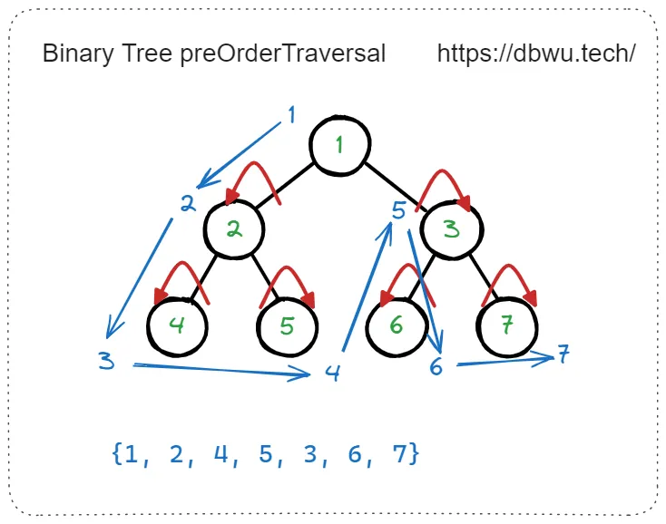
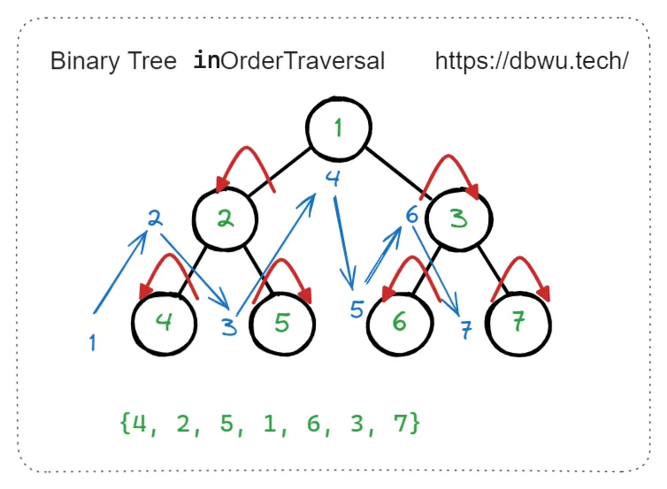

# 1. 基础

>在计算机科学中，二叉树是一种树形数据结构，其中每个节点最多有两个子节点，称为左子节点和右子节点。

## 前序 (先序) 遍历

先访问根节点，然后 (递归) 前序遍历左子树，最后 (递归) 前序遍历右子树。



```go
// 简单递归版本
func preOrderTraversal(root *TreeNode) {
	if root != nil {
		// 先访问根节点
		fmt.Println(root.Val)
		// 然后 (递归) 前序遍历左子树
		preOrderTraversal(root.Left)
		// 最后 (递归) 前序遍历右子树
		preOrderTraversal(root.Right)
	}
}
```

迭代：
首先我们应该创建一个 `Stack` 用来存放节点，首先我们想要打印根节点的数据，此时 Stack 里面的内容为空，所以我们优先将头结点加入 `Stack`，然后打印。

之后我们应该先打印左子树，然后右子树。所以先加入 `Stack` 的就是右子树，然后左子树。

```go
func preOrderTraversal(root *TreeNode) {
	if root == nil {
		return
	}

	stack := []*TreeNode{root}

	for len(stack) != 0 {
		node := stack[len(stack)-1]
		stack = stack[:len(stack)-1]
		fmt.Println(node.Val)
		if node.Right != nil {
			stack = append(stack, node.Right)
		}
		if node.Left != nil {
			stack = append(stack, node.Left)
		}
	}
}
```
## 中序遍历

先 (递归) 中序遍历左子树，然后访问根节点，最后 (递归) 中序遍历右子树。



```go
// 简单递归版本
func inOrderTraversal(root *TreeNode) {
	if root != nil {
		// 先 (递归) 中序遍历左子树
		inOrderTraversal(root.Left)
		// 然后访问根节点
		fmt.Println(root.Val)
		// 最后 (递归) 中序遍历右子树
		inOrderTraversal(root.Right)
	}
}
```

迭代：

1. 创建一个 `Stack`，然后按左中右的顺序输出节点。
2. 尽可能的将这个节点的左子树压入 `Stack`，此时栈顶的元素是最左侧的元素，其目的是找到一个最小单位的子树 (也就是最左侧的一个节点)，并且在寻找的过程中记录了来源，才能返回上层, 同时在返回上层的时候已经处理完毕左子树了。
3. 当处理完最小单位的子树时，返回到上层处理了中间节点。（如果把整个左中右的遍历都理解成子树的话，就是处理完左子树->中间 (就是一个节点)->右子树）
4. 如果有右节点，其也要进行中序遍历。

```go
func inOrderTraversal(root *TreeNode) {
	if root == nil {
		return
	}

	cur := root
	stack := []*TreeNode{}
	for cur != nil || len(stack) != 0 {
		for cur != nil {
			stack = append(stack, cur)
			cur = cur.Left
		}
		cur = stack[len(stack)-1]
		stack = stack[:len(stack)-1]
		fmt.Println(cur.Val)
		cur = cur.Right
	}
}

```
## 后序遍历

先 (递归) 后序遍历左子树，然后 (递归) 后序遍历右子树，最后访问根节点。


```go
// 简单递归版本
func postOrderTraversal(root *TreeNode) {
	if root != nil {
		// 先 (递归) 后序遍历左子树
		postOrderTraversal(root.Left)
		// 然后 (递归) 后序遍历右子树
		postOrderTraversal(root.Right)
		// 最后访问根节点
		fmt.Println(root.Val)
	}
}
```

迭代 1：
1. 前序遍历的过程 是 中左右。
2. 将其转化成 中右左。也就是压栈的过程中优先压入左子树，在压入右子树。

```go
// 迭代版本1
func postOrderTraversal(root *TreeNode) []int {
	if root == nil {
		return nil
	}

	stack := []*TreeNode{}
	output := []*TreeNode{}

	// 把根节点压入stack
	stack = append(stack, root)

	// 当stack不为空时
	for len(stack) > 0 {
		// 弹出stack的最后一个元素
		node := stack[len(stack)-1]
		stack = stack[:len(stack)-1]

		// 把该元素压入output
		output = append(output, node)

		// 把该节点的左子节点压入stack
		if node.Left != nil {
			stack = append(stack, node.Left)
		}
		// 把该节点的右子节点压入stack
		if node.Right != nil {
			stack = append(stack, node.Right)
		}
	}

	// 准备结果
	result := []int{}
	// 把output中的元素依次弹出即为后序遍历结果
	for len(output) > 0 {
		node := output[len(output)-1]
		output = output[:len(output)-1]
		result = append(result, node.Val)
	}

	return result
}
```

迭代 2：

1. 用一个指针 `prev` 标记当前退出的节点是什么。
2. 后序遍历的过程中在遍历完左子树跟右子树 `prev` 都会回到根结点。所以当前不管是从左子树还是右子树回到根结点都不应该再操作了，应该退回上层。
3. 如果是从右边再返回根结点，应该回到上层。

```go
func postOrderTraversal(root *TreeNode) {
	if root == nil {
		return
	}

	stack := []*TreeNode{root}
	var prev *TreeNode

	for len(stack) > 0 {
		peek := stack[len(stack)-1]
		if peek.Left != nil && peek.Left != prev && peek.Right != prev {
			stack = append(stack, peek.Left)
		} else if peek.Right != nil && peek.Right != prev {
			stack = append(stack, peek.Right)
		} else {
			fmt.Println(peek.Val)
			stack = stack[:len(stack)-1]
			prev = peek
		}
	}
}
```

# 2. 构建二叉树

## [105. 从前序与中序遍历序列构造二叉树](https://leetcode.cn/problems/construct-binary-tree-from-preorder-and-inorder-traversal/description/)

给定两个整数数组 `preorder` 和 `inorder` ，其中 `preorder` 是二叉树的**先序遍历**， `inorder` 是同一棵树的**中序遍历**，请构造二叉树并返回其根节点。


> **输入:**  preorder = [3,9,20,15,7], inorder = [9,3,15,20,7]
> **输出:**  [3,9,20,null,null,15,7]

### 思路

1. 根据题目给出的两种遍历方式计算出根节点，**前序遍历数组的第一个元素就是根节点**
2. 找到 **中序遍历数组中根节点的值对应的索引**，并根据索引将数组分成两个部分，左半部分就是左子树的所有节点值，右半部分就是右子树的所有节点值
3. 递归数组左半部分，**并将返回值赋值给 根节点的左节点**
4. 递归数组右半部分，**并将返回值赋值给 根节点的右节点**

### 代码实现

```go
func buildTree(preorder []int, inorder []int) *TreeNode {
	if len(preorder) == 0 {
		return nil
	}

	// 前序遍历数组的第一个元素就是根节点
	root := &TreeNode{Val: preorder[0]}

	for i := range inorder {
		// 找到中序遍历数组中根节点的值对应的索引
		// 并根据索引将数组分成两个部分
		if inorder[i] == root.Val {
			// 左半部分就是左子树的所有节点值
			root.Left = buildTree(preorder[1:i+1], inorder[:i])
			// 右半部分就是右子树的所有节点值
			root.Right = buildTree(preorder[i+1:], inorder[i+1:])
		}
	}

	return root
}
```

## [106. 从中序与后序遍历序列构造二叉树](https://leetcode.cn/problems/construct-binary-tree-from-inorder-and-postorder-traversal/)

给定两个整数数组 `inorder` 和 `postorder` ，其中 `inorder` 是二叉树的中序遍历， `postorder` 是同一棵树的后序遍历，请你构造并返回这颗 _二叉树_ 。


> **输入：** inorder = [9,3,15,20,7], postorder = [9,15,7,20,3]
> **输出：** [3,9,20,null,null,15,7]

### 思路

后序遍历的最后一个节点是根节点，我们可以根据这个特点找到根节点在中序遍历中的位置，然后递归地构造左右子树。

具体地，我们先用一个哈希表 `d` 存储中序遍历中每个节点的位置。然后我们设计一个递归函数 `dfs(i, j, n)`，其中 `i` 和 `j` 分别表示中序遍历和后序遍历的起点，而 `n` 表示子树包含的节点数。函数的逻辑如下：

1. 如果 `n ≤ 0`，说明子树为空，返回空节点。
2. 否则，取出后序遍历的最后一个节点 `v`，然后我们在哈希表 `d` 中找到 `v` 在中序遍历中的位置，设为 `k`。那么左子树包含的节点数为 `k - i`，右子树包含的节点数为 `n - k + i - 1`。
3. 递归构造左子树 `dfs(i, j, k - i)` 和右子树 `dfs(k + 1, j + k - i, n - k + i - 1)`，并连接到根节点上，最后返回根节点。

### 代码实现

```go
func buildTree(inorder []int, postorder []int) *TreeNode {
	d := map[int]int{}
	for i, v := range inorder {
		d[v] = i
	}
	var dfs func(i, j, n int) *TreeNode
	dfs = func(i, j, n int) *TreeNode {
		if n <= 0 {
			return nil
		}
		v := postorder[j+n-1]
		k := d[v]
		l := dfs(i, j, k-i)
		r := dfs(k+1, j+k-i, n-k+i-1)
		return &TreeNode{v, l, r}
	}
	return dfs(0, 0, len(inorder))
}
```